**Fred. Systems programmer: C, Go and Rust, and assembly when a profiler says so. Builds the API and SDKs at [RoxyAPI](https://github.com/RoxyAPI).**

### Working on

- [RoxyAPI/sdk-go](https://github.com/RoxyAPI/sdk-go): the typed Go client
- [RoxyAPI/sdk-typescript](https://github.com/RoxyAPI/sdk-typescript): the TypeScript client
- [RoxyAPI](https://github.com/RoxyAPI): the rest of the org's open source

### How I work

- Small, dependency-free libraries that do one thing and stay out of the way
- Performance work: allocation, cache behaviour, the hot loop nobody wants to touch
- Linux and the GNU toolchain every day: gcc, gdb, make, perf

The header is plain SVG + SMIL, no scripts or trackers, generated by <code>main.go</code>: <code>go run . &gt; terminal.svg</code>
